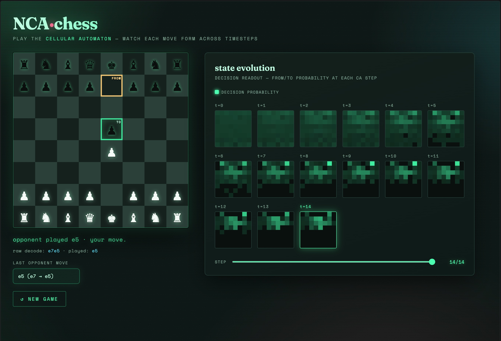
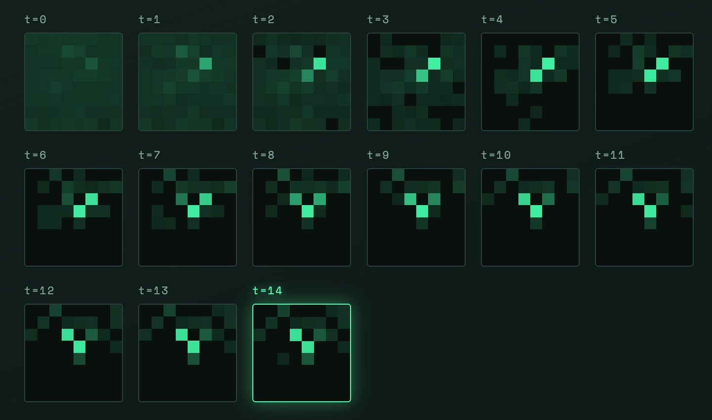

# NCA·chess

> Play the cellular automaton — watch each move form across timesteps.

A **Neural Cellular Automaton (NCA)** that predicts chess moves. Instead of mapping a
board to a move in one shot, the model runs a local update rule over the 8×8 grid for
many iterations. Each square only ever talks to its immediate neighbours, so a move has to
grow out of repeated, short-range communication. 

A web frontend lets you play against
the trained model and watch the from/to decision crystallize step by step.



---

## Architecture

The pipeline has four parts: a perspective-canonical board encoding, the cellular
automaton itself, a factored policy head, and a legality-aware decoder used at play time.

### 1. Board encoding — mover's perspective

A position is encoded as a 12 × 8 × 8 binary occupancy tensor: 6 piece types × 2
colours, one plane each, with a `1` wherever a piece of that type sits.

The board is canonicalized to the side to move. When it is Black's turn the
ranks are flipped and the two colour halves are swapped, so the network always sees the
position as "White to move." 

### 2. The cellular automaton

The working state is an 8 × 8 grid with 80 channels per cell. The first 12 channels
hold the (fixed) board input; the remaining channels are hidden space, initialized
to zero. One step of the automaton does three things:

- **Perceive** — a single 3×3 convolution. This is the only place spatial information
  moves between squares, so a cell gains one "ring" of neighbourhood awareness per step.
- **Update** — a small per-cell network that proposes a residual change to the state. It
  starts initialized to do nothing.
- **Stabilize** — the change is added to the state, the true board is re-injected into the
  input channels (so the position never drifts), and the hidden channels are bounded to
  stay numerically stable across a long rollout.

The step repeats **15 times**. Because information spreads one ring per step, after ~15
steps a cell's effective receptive field covers the whole board.

### 3. Factored policy head

A final readout maps the state to two 8×8 probability maps: a from map and a to
map. The move distribution is factored as the product of the two, and the model is trained
with cross-entropy on the from-square and the to-square separately.

### 4. Decoding & the "state evolution" view

At play time the readout is applied at every step of the rollout, producing a sequence
of 8×8 decision-probability frames that show how the chosen move emerges over time, this
is exactly the grid on the right of the UI.



The final move is the highest-probability legal (from, to) pair: the raw argmax is used
when it is legal, and otherwise the prediction is projected onto the set of legal moves by
combined from/to score. 

---

## Training

The model is trained on human games from
[angeluriot/Chess_games](https://github.com/angeluriot/Chess_games). To keep the training
set diverse, the first few opening plies of each game are skipped and only a handful of positions are taken from any single game.

---

## Setup

```bash
pip install torch python-chess datasets flask numpy tqdm
```

## Usage

1. Build and cache the training set from the source games.
2. Train the model and save the weights.
3. Launch the web app and open it in your browser — the board is on the left, and the
   right panel animates the from/to decision probability at each of the 15 automaton
   steps. 
